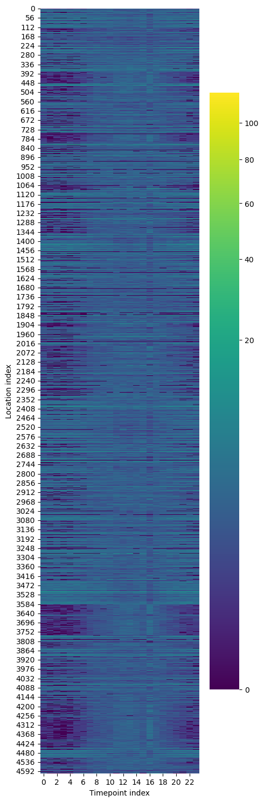

# AMPNet: Digital twins of human mobility in cities using Adaptive Massively Parallel NETworks

## Overview

This repository hosts **AMPNet** (Adaptive Massively Parallel Networks), a computational framework for modeling and simulating emergent, adaptive changes to human mobility patterns in cities. Our goal is to quantify how “city-scale immune systems”—built from low-friction, adaptive changes in movement—can reduce the spread of infectious diseases in urban environments.

The project leverages high-resolution mobility data and modern AI methods to create **digital twins** of cities, enabling large-scale, data-driven experiments on epidemic control strategies.

## Scientific Vision

Cities, while engines of culture and economy, are terribly efficient amplifiers of epidemic risk. 
This project asks:  
**What if cities could adaptively attenuate, rather than amplify, epidemic spread, while preserving daily life?**

By combining:
- **Massive real-world mobility datasets** (SafeGraph, FEMA, US Census)
- **Parallelized neural network models** (one network per synthetic resident)
- **Distributed, high-performance GPU computing**

we aim to discover how coordinated yet minimally disruptive changes in movement (e.g., desynchronizing transit or shopping) can transform epidemic trajectories at city scale.

---
#### Digital twin model for the city of Newport, showing synthetic population embedded in real physical and demographic structure, and hourly mobility patterns estimated from mobile device data (Safegraph) for each hour of the year for two example locations.

---

#### Bilding the Digital Twin of the city of Newport, Oregon, est. pop. 10,489. 

Neural networks are trained to represent patterns of human mobility within the city.

https://github.com/user-attachments/assets/057d55ec-036b-4001-a0b2-34d39606c348

Geospatial features represented in the Digital Twin:

https://github.com/user-attachments/assets/663cc11f-003e-46f9-9dc8-0d05228d3995

_Residential and non-residential buildings extracted from the FEMA USA Structures dataset._

https://github.com/user-attachments/assets/e3c699d5-3d79-49de-a0b0-02c38082f027

_Census Block Group geometry provided by the U.S. Census Bureau._

https://github.com/user-attachments/assets/7c5d5f22-3e83-4d90-a3d7-716ceed0f746

_Hourly Arrival Counts (human mobility data) provided by SafeGraph (with identity protections)._

We can examine the building classification, hourly visits, Census Block Group, and aggregated daily visits at each location.

https://github.com/user-attachments/assets/6ad23119-7ec7-4100-9dc6-f96721ceb9c1

https://github.com/user-attachments/assets/e4f53e19-1663-467c-ad4c-f4cd627182c0

https://github.com/user-attachments/assets/94755f13-08f2-473a-8be8-d3dae8792118

https://github.com/user-attachments/assets/b09fd778-ccc9-41fa-8648-6419d9b72d63

---

Circadian movement patterns across all physical structures in the city of Newport, Oregon

---

### Validation of one individual's movement net after some training.
